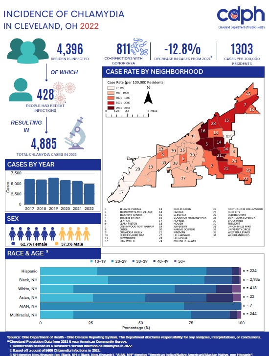
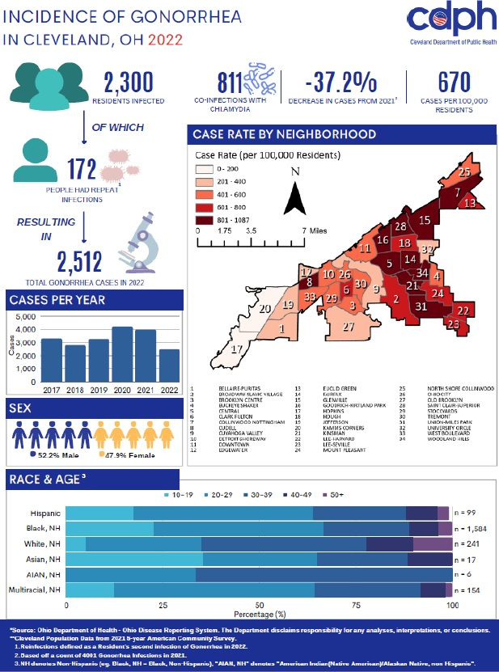
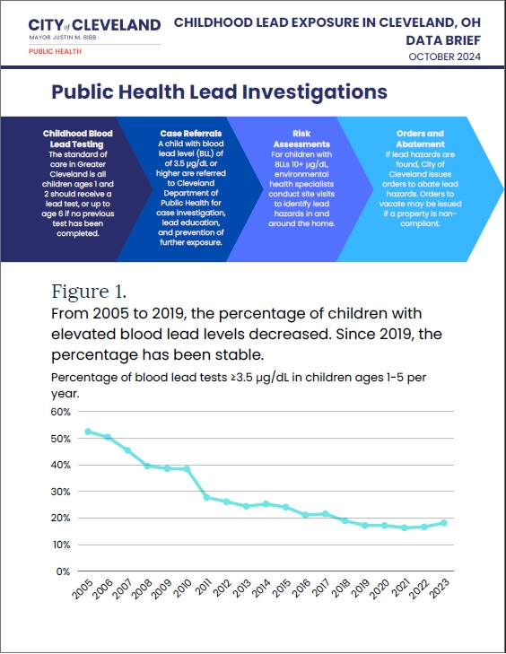
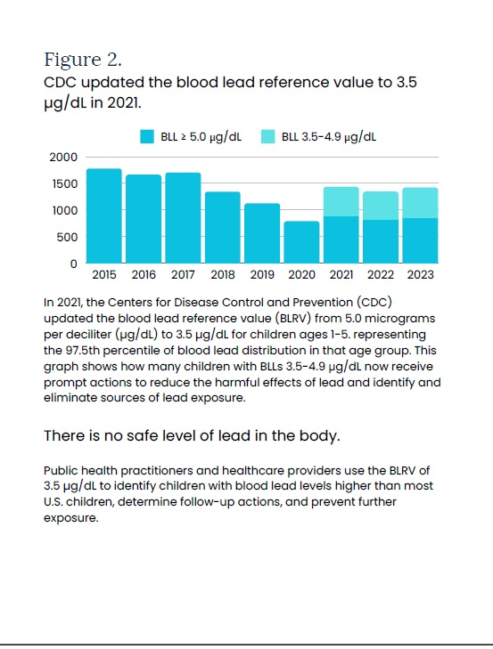
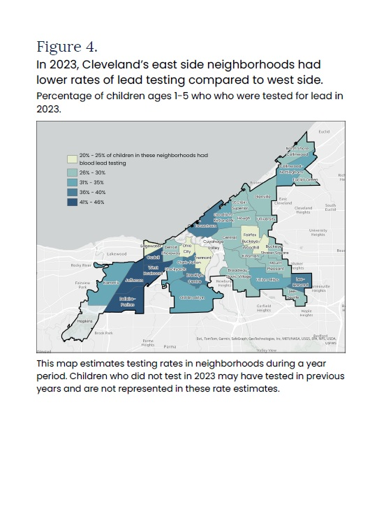

--- 
title: "Dashboard"
author: "Maleek Cusack"
format: 
  dashboard:
    scrolling: true
    nav-buttons: [linkedin, twitter, github]
---

# Previous Materials

::: {.card title="Product Preview"}
CDPH Materials Preview
:::
```{r chunk1}
#| include: false
#| eval: true
install.packages(c("reticulate","shiny","shinydashboard"),repos = "http://cran.us.r-project.org")
library(reticulate)
install_python(version = "3.11:latest")
virtualenv_create("my-quarto-env") 
use_virtualenv("my-quarto-env", required = TRUE)
py_install(c("ipyleaflet","plotly","pandas"), pip = TRUE)
```

## Row


```{r}
#| content: valuebox
#| title: "2022 STI Reports"
#| echo: false
#| results: asis

cat('
<div style="
  display: grid;
  grid-template-columns: 1fr 1fr;
  gap: 10px;
  width: 100%;
">
  
  
</div>
')

```

## Row
```{r}
#| content: valuebox
#| title: "2023 Lead Data Brief"
#| echo: false
#| results: asis

cat('
<div style="
  display: grid;
  grid-template-columns: repeat(3, 1fr);
  gap: 10px;
">
  
  
  
</div>
')
```

# Products